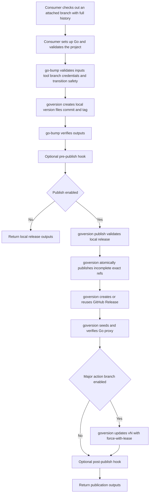

# `go-bump` implementation plan

## Product summary

`go-bump` is an action-only composite GitHub Action that orchestrates a consumer-pinned `goversion` tool.

The action preserves a local-first release workflow by running the same `go tool github.com/bcomnes/goversion/v2` commands that maintainers can run locally.

The supported integration target is `goversion v2.3.0`.

The consumer owns checkout, Go setup, dependency download, and any project-specific validation that runs before the action.

`go-bump` owns action input validation, Git identity, safe credential setup, lifecycle orchestration, outputs, optional trusted hooks, and action-level capability checks.

`goversion` owns version calculation, source updates, local release commit and tag creation, atomic exact branch and tag publication, GitHub Release creation or reuse through `gh`, and Go module proxy seeding and verification.

Publication is enabled by default because a release action should complete the remote Go module release unless the caller explicitly requests a local-only run.

## Current implementation status

The v1 composite action, orchestration script, consumer documentation, pinned dependency, self-hosting release workflow, and initial temporary-repository integration suite are implemented.

Local validation currently passes with:

```console
bash -n scripts/go-bump.sh test/integration.sh
make all
git diff --check
```

The moving major-branch implementation lives in published `goversion v2.3.0`, and `go-bump` only capability-checks and passes through `publish -major-branch`.

The remaining work is expanded edge-case coverage, richer partial-failure diagnostics, and a controlled GitHub-hosted end-to-end release proving real token-authenticated push, GitHub Release creation, moving major-branch publication, and public proxy verification.

No production GitHub release or public module publication has been performed from this repository yet.

## Goals

1. Provide a small reusable action for releasing a single repository-root Go module.
2. Require an exact consumer-selected `goversion` tool version through the consumer's committed Go tool dependency.
3. Keep local and CI commands equivalent.
4. Support safe stable, prerelease, and explicit semantic-version directives accepted by `goversion v2.3.0`.
5. Reject unsafe cross-major transitions before `goversion` mutates the repository.
6. Preserve a clear two-phase boundary between local release creation and remote publication.
7. Delegate module publication mechanics to `goversion publish`.
8. Pass through opt-in moving major action-branch publication so the action can self-host without duplicating Git logic.
9. Produce exact version, tag, commit, branch, major action branch, and publication outputs.
10. Keep credentials out of command arguments, remote URLs, outputs, and logs.
11. Make failed publication safely resumable through another `goversion publish` invocation.

## Non-goals

The first release does not implement semantic versioning, Go module migration, Git pushing, GitHub Release operations, proxy requests, changelog generation, artifact upload, signing, package-manager publication, or binary packaging itself.

The first release does not install or upgrade `goversion` for the consumer.

The first release does not support detached `HEAD`, nested modules, multi-module repositories, or Go workspaces.

The first release does not provide a Go package or standalone `go-bump` CLI.

The first release does not automatically roll back local release commits or tags.

The first release does not delete published tags or rewrite remote history during recovery.

## Ownership boundary

### Consumer workflow responsibilities

The consumer checks out full history and tags on the branch that will be released.

The consumer sets up the Go version declared by the repository.

The consumer commits the pinned `goversion` tool dependency before running the action.

The consumer downloads dependencies and may run tests, linting, builds, or policy checks before invoking the action.

The consumer grants `contents: write` when publication or GitHub Release creation is enabled.

The consumer supplies trusted hook commands only from repository-controlled workflow configuration.

### `go-bump` responsibilities

`go-bump` validates action-level syntax and policy before invoking a mutating command.

`go-bump` verifies that `goversion v2.3.0` is available through the consumer's Go tool dependency.

`go-bump` requires an attached current branch and rejects detached `HEAD` before local versioning.

`go-bump` configures the release commit author name and email.

`go-bump` configures credentials without embedding tokens in logged command lines or persisted remote URLs.

`go-bump` maps versioning inputs to the `goversion` version command.

`go-bump` maps publication inputs to `goversion publish` flags.

`go-bump` runs optional hooks at documented lifecycle boundaries.

`go-bump` derives and validates outputs from the resulting version file and exact Git state.

`go-bump` reports enough state for a maintainer to resume or recover safely.

### `goversion v2.3.0` responsibilities

The version command reads or initializes the dedicated version file and resolves the requested directive.

The version command updates configured files, performs supported module-path and self-import changes, runs its optional post-bump executable, creates the local version commit, and tags `HEAD` with `v<version>`.

The publish command validates the repository-root module, clean worktree, attached branch, version, and matching local tag at `HEAD`.

The publish command atomically pushes only the incomplete exact branch and tag refs to the selected remote.

The publish command rejects a remote tag that points to a different commit.

The publish command creates or reuses a GitHub Release with generated notes through an available authenticated `gh` CLI.

The publish command warns and skips GitHub Release creation when `gh` is missing or unauthenticated unless an available authenticated `gh` command fails.

The publish command seeds and verifies the complete module version through `go mod download` against the selected proxy.

The publish command retries recognized transient proxy failures and treats permanent proxy failures as fatal.

The publish command is resumable and reports `planned`, `completed`, `reused`, or `skipped` status for publication stages.

## Required local setup

Consumers must pin the currently supported tool version in the repository rather than using `@latest`.

```console
go get -tool github.com/bcomnes/goversion/v2@v2.3.0
git add go.mod go.sum
git commit -m "Add goversion v2.3.0 release tool"
```

A maintainer can then use the same two-phase lifecycle locally.

```console
go tool github.com/bcomnes/goversion/v2 patch
go test ./...
go tool github.com/bcomnes/goversion/v2 publish
```

The action must not run `go get`, `go install`, or `go run ...@version` as a fallback.

A missing or mismatched tool must fail before mutation with the exact pinned setup command.

## Action interface

### Version selection inputs

| Input | Default | Contract |
|---|---|---|
| `version-type` | none | This input accepts `major`, `minor`, `patch`, `premajor`, `preminor`, `prepatch`, `prerelease`, or `custom`. |
| `new-version` | none | This input supplies a valid explicit semantic version when `version-type` is `custom` or omitted. |
| `version-file` | `./version.go` | This input maps to the version command's `-version-file` flag. |
| `files` | none | This newline-delimited input maps each nonempty line to one repeated `-file` flag. |
| `bump-files` | none | This newline-delimited input maps each nonempty line to one repeated `-bump-file` flag. |
| `post-bump` | none | This executable path maps to the version command's `-post-bump` flag. |

`from-git` and `dev` are not action release directives.

A concrete directive conflicts with `new-version` and must be rejected.

`custom` requires `new-version`.

An omitted `version-type` requires `new-version`.

Explicit versions must not contain a leading `v`, whitespace, newlines, or flag-like prefixes.

List entries must be repository-relative paths without empty, absolute, parent-traversal, or newline-containing values.

`post-bump` is an executable path rather than an arbitrary shell expression.

Files modified by `post-bump` must also be named in `files` when they belong in the version commit.

### Publication inputs

| Input | Default | `goversion publish` mapping |
|---|---|---|
| `publish` | `true` | A false value skips the publish command after local version creation. |
| `publish-dry-run` | `false` | A true value adds `-dry` and performs publication preflight without remote mutation. |
| `remote` | `origin` | A nondefault value maps to `-remote=<value>`. |
| `proxy` | `https://proxy.golang.org` | A nondefault value maps to `-proxy=<value>`. |
| `publish-timeout` | `2m` | A nondefault Go duration maps to `-timeout=<value>`. |
| `create-release` | `true` | A false value maps to `-no-release`. |
| `seed-proxy` | `true` | A false value maps to `-no-proxy`. |
| `major-branch` | `false` | Maps to `goversion publish -major-branch` after verifying that the pinned tool supports it. |

Publication settings are rejected when `publish` is false unless they retain their defaults.

`publish-dry-run` still requires the local version commit and matching local tag because it previews only the remote publication phase.

`create-release` controls only the GitHub Release stage and does not control Git ref publication.

`seed-proxy` should be false for private modules or modules that must not contact the configured proxy.

`major-branch` requires `publish: true`.

`go-bump` checks `goversion publish -help` for the capability before mutation and fails with an upgrade command when the pinned release is too old.

`goversion` derives `vN`, plans it during dry-run, updates it last after every enabled publication stage succeeds, pushes with force-with-lease, verifies the remote ref, and reports planned, completed, reused, or skipped status.

The action must pass each flag as a separately quoted argument without `eval`.

### Orchestration and identity inputs

| Input | Default | Contract |
|---|---|---|
| `git-username` | `${{ github.actor }}` | This value configures the local release commit author name. |
| `git-email` | the actor's GitHub noreply address | This value configures the local release commit author email. |
| `github-token` | `${{ github.token }}` | This secret supplies safe Git and `gh` authentication when publication is enabled. |
| `pre-publish` | none | This trusted command runs after local commit and tag creation but before publication. |
| `post-publish` | none | This trusted command runs only after successful publication or successful publication dry-run. |

`pre-publish` is the optional in-action validation boundary for tests or checks that must inspect the exact release commit before it reaches the remote.

A failing `pre-publish` stops before remote mutation and leaves the local release commit and tag available for inspection.

`post-publish` is for notifications or project-specific follow-up and is not part of `goversion` publication atomicity.

A failing `post-publish` does not mean that the already published Go release was rolled back.

Hook commands receive `GOVERSION_OLD_VERSION`, `GOVERSION_NEW_VERSION`, `GO_BUMP_TAG`, `GO_BUMP_COMMIT`, and `GO_BUMP_BRANCH`.

`github-token` may be exposed to child processes only through the standard masked `GH_TOKEN` and credential mechanism needed by the selected transport.

The token must not be exported to `post-bump`, `pre-publish`, or `post-publish` unless a future explicit opt-in requirement is approved.

### Outputs

| Output | Meaning |
|---|---|
| `old-version` | This is the version read before local versioning. |
| `new-version` | This is the version read after successful local versioning. |
| `release-tag` | This is the exact local tag `v<new-version>` verified at `HEAD`. |
| `release-commit` | This is the exact commit SHA at the release tag. |
| `release-branch` | This is the attached branch validated before versioning and publishing. |
| `published` | This is `true` only after `goversion publish` exits successfully without `-dry`. |
| `publish-dry-run` | This is `true` only when publication preflight succeeds with `-dry`. |
| `major-branch` | This is the moving `vN` action branch updated by the release, or empty when disabled. |

Outputs describing the local release are written immediately after the local commit and tag are verified.

Publication outputs are written only after the corresponding publish command succeeds.

## Supported transition policy

`patch`, `minor`, and `major` are supported when their resulting module migration is safe under `goversion v2.3.0`.

`premajor`, `preminor`, `prepatch`, and `prerelease` are supported as directives.

Explicit stable and prerelease semantic versions are supported when they remain within the current semantic major.

Any directive or explicit version that crosses the semantic major boundary is rejected unless it is the literal `major` directive on a transition that `goversion v2.3.0` migrates safely.

`premajor` is therefore rejected whenever it would enter a new semantic major because v2.3.0 does not safely generalize module migration for that transition.

An explicit version is rejected whenever its semantic major differs from the current version's semantic major.

A prerelease directive is rejected whenever its resolved target would cross the semantic major boundary.

These checks are temporary compatibility guards rather than a second module-migration implementation.

The guards can be relaxed only after a tested `goversion` release bases module migration on the old and new semantic major versions for every directive form.

## Two-phase validation boundary

### Phase one preflight

Before local mutation, `go-bump` validates all action inputs, strict booleans, Go durations, paths, hook configuration, and input combinations.

Before local mutation, `go-bump` verifies a Git worktree, repository root, attached branch, absence of an in-progress merge or history operation, and the required consumer-pinned `goversion v2.3.0` tool.

Before local mutation, `go-bump` reads the old version and resolves enough of the requested target to enforce the cross-major policy.

Before local mutation, `go-bump` verifies that publication credentials and remote configuration are present when publication is enabled.

`goversion` remains authoritative for its own clean-tree, version-file, module, commit, and tag checks.

### Local version phase

`go-bump` invokes the version command from the repository root with the mapped flags and one validated directive or explicit version.

A version-command dry-run is not part of the initial action interface because the release action is designed around creating a local release candidate and then deciding whether to publish it.

After success, `go-bump` verifies the new version, exact `v<version>` tag at `HEAD`, release commit SHA, and unchanged attached branch.

After verification, `go-bump` emits local outputs and runs `pre-publish` when configured.

### Phase two publication validation

`goversion publish` owns the authoritative second preflight against the completed local release candidate.

That preflight requires a clean worktree, attached current branch, repository-root module, version compatible with the module path, and matching local tag at `HEAD`.

`go-bump` must not duplicate or weaken those checks.

If `publish` is false, the action stops after local verification and the optional `pre-publish` hook.

If `publish` is true, the action invokes `goversion publish` with the mapped publication flags.

When enabled, `goversion publish` maintains the moving major action branch as its final publication checkpoint.

After publication, `go-bump` derives the expected major-branch output and runs `post-publish` when configured.

## Release flow



## Attached branch checkout example

The release workflow must explicitly check out the branch that will receive the version commit rather than accepting the event's detached commit.

```yaml
name: Release

on:
  workflow_dispatch:
    inputs:
      version-type:
        description: Version bump
        required: true
        type: choice
        options:
          - patch
          - minor
          - major
          - premajor
          - preminor
          - prepatch
          - prerelease
          - custom
      new-version:
        description: Explicit semantic version for custom
        required: false
        type: string

permissions:
  contents: write

jobs:
  release:
    runs-on: ubuntu-latest
    steps:
      - uses: actions/checkout@v4
        with:
          ref: ${{ github.event.repository.default_branch }}
          fetch-depth: 0
          persist-credentials: false

      - uses: actions/setup-go@v5
        with:
          go-version-file: go.mod

      - name: Verify pinned release tool
        run: go tool github.com/bcomnes/goversion/v2 -version

      - run: go mod download

      - run: go test ./...

      - id: bump
        uses: bcomnes/go-bump@<immutable-release-ref>
        with:
          version-type: ${{ inputs.version-type }}
          new-version: ${{ inputs.new-version }}
          github-token: ${{ github.token }}
```

A workflow that releases a selectable branch should use a validated workflow input for `ref` and should not infer a branch from detached `HEAD`.

## Authentication and credential safety

The preferred checkout configuration uses `persist-credentials: false` so the action controls the credential lifetime.

The action should use an ephemeral Git credential helper or equivalent masked mechanism accepted by Git without modifying the stored remote URL.

The action should set `GH_TOKEN` only for the `goversion publish` process so `gh` can authenticate without a command-line token.

The action should remove any temporary credential configuration in an always-running cleanup step.

The action should disable shell tracing around credential setup and publication.

The action should rely on GitHub masking but must not print secret-bearing environment variables or credential-helper responses.

Missing publication credentials must fail before local mutation when `publish` is true rather than silently producing a local-only release.

Insufficient remote permissions may still be discovered by `goversion publish`, and that failure must preserve the local release for resume.

## Recovery and resume semantics

A failure before the version command leaves repository state unchanged by `go-bump`.

A failure during local versioning may leave files, a commit, or a local tag because `goversion` does not promise transactional rollback for the local phase.

On a local-phase failure, the action reports `git status`, current branch, `HEAD`, and whether the expected local tag exists without deleting or resetting anything.

A `pre-publish` failure intentionally leaves a complete local release commit and tag that has not been remotely published by this action.

The maintainer may inspect and test that local candidate before deciding to publish it manually or remove only unpushed local state.

A publication failure is resumed by rerunning the same `goversion publish` command against the same release commit, tag, and branch.

On resume, `goversion` reuses exact remote refs that already point to the release commit, reuses an existing GitHub Release, and continues incomplete work such as proxy seeding.

A remote tag at another commit is a hard conflict and must never be overwritten automatically.

A failure after Git refs are published must be reported as a partially completed public release rather than as a rolled-back release.

A `post-publish` failure occurs after successful publication and rerunning the whole action is not the recovery mechanism for that hook.

Recovery documentation should show how to rerun `go tool github.com/bcomnes/goversion/v2 publish` with the same mapped flags.

Recovery documentation may show local tag deletion or local commit reset only after the maintainer verifies that neither ref was published.

## Implementation phases

### Phase 1: Action structure and validation

- [x] Define only the inputs and outputs in this plan in `action.yml`.
- [x] Add a reusable orchestration script with strict input parsing and argument-array command construction.
- [x] Verify `goversion v2.3.0` through the committed Go tool dependency.
- [x] Validate the repository root, attached branch, Git operation state, remote configuration, paths, and applicable HTTPS credentials before mutation.
- [x] Implement semantic transition preflight that rejects unsafe cross-major forms without performing module migration.
- [x] Configure repository-local Git identity and ephemeral process-scoped HTTPS credentials.
- [x] Keep the repository action-only and replace stale package/server assumptions with action-oriented build and test tasks.

### Phase 2: Local release orchestration

- [x] Build the version command as an argument array with repeated `-file` and `-bump-file` values.
- [x] Invoke the consumer-pinned tool from the repository root.
- [x] Read the old and new versions from the dedicated version file rather than decorative command output.
- [x] Verify the exact local tag at `HEAD`, release commit, and attached branch.
- [x] Emit local outputs through `GITHUB_OUTPUT`.
- [x] Run the optional trusted `pre-publish` hook after local verification.
- [x] Avoid automatic rollback and preserve local release state on failure.
- [ ] Expand failure diagnostics to print a concise state summary for every partial local failure path.

### Phase 3: Publication orchestration

- [x] Build `goversion publish` arguments from `publish-dry-run`, `remote`, `proxy`, `publish-timeout`, `create-release`, and `seed-proxy`.
- [x] Let `goversion publish` exclusively own Go module branch/tag push, GitHub Release, and proxy operations.
- [x] Add opt-in `-major-branch` pass-through with a pre-mutation capability check.
- [x] Scope `GH_TOKEN` and ephemeral Git credentials to publication and remove tokens from hook environments.
- [x] Set `published` only after a successful non-dry publication.
- [x] Set the publication dry-run output only after a successful `-dry` invocation.
- [x] Run the optional trusted `post-publish` hook after successful publication handling.
- [x] Stream `goversion` publication progress and statuses so resume behavior remains understandable.
- [ ] Verify authenticated HTTPS publication and GitHub Release creation in a controlled GitHub-hosted end-to-end test.
- [ ] Verify real public proxy seeding in a controlled release test.
- [x] Verify moving major action-branch creation, dry-run, reuse, lease safety, and advancement in `goversion` tests.
- [x] Verify the `go-bump` pass-through against published `goversion v2.3.0` across moving major-branch creation and advancement.

### Phase 4: Self-hosting release workflow

- [x] Add a manually dispatched workflow that checks out the attached default branch with full history.
- [x] Invoke the checked-out action with `uses: ./` so releasing does not depend on an already published `go-bump` version.
- [x] Run `make all` before versioning and again through `pre-publish` against the exact release candidate.
- [x] Enable `major-branch` so each self-release creates or advances the compatible moving `vN` action branch.
- [ ] Run the workflow in GitHub and verify the exact tag, GitHub Release, proxy result, and moving major branch.

### Phase 5: Documentation

- [x] Document exact pinned local setup with `v2.3.0`.
- [x] Document attached branch checkout and full history requirements.
- [x] Document all action inputs and their exact `goversion` flag mappings.
- [x] Document prerelease support and temporary cross-major rejection rules.
- [x] Document default publication, private-module proxy opt-out, and GitHub Release opt-out.
- [x] Document credential permissions and trusted-hook risks.
- [x] Document local failure recovery and resumable publication commands.
- [x] Document that `pkg.go.dev` indexing may lag after proxy seeding succeeds.

## Test plan

### Input and policy tests

- [x] Test a valid patch directive through local release creation.
- [ ] Test every other supported version directive and same-major explicit stable and prerelease versions.
- [ ] Test missing, conflicting, unknown, multiline, whitespace-containing, leading-`v`, and flag-like version values.
- [x] Test that an invalid strict Boolean fails before mutation.
- [ ] Test the remaining strict booleans and valid and invalid Go duration values.
- [ ] Test repeated file inputs, path traversal rejection, absolute path rejection, and paths containing spaces.
- [ ] Test all unsafe explicit and prerelease cross-major transitions are rejected before mutation.
- [ ] Test a supported literal `major` migration with module path and self-import verification.
- [ ] Test missing and non-v2.3.0 consumer tools fail before mutation with pinned setup guidance.

### Repository and local phase tests

- [ ] Test rejection of detached `HEAD` before mutation.
- [ ] Test rejection of merge, rebase, cherry-pick, and revert states.
- [ ] Test dirty-tree behavior with and without explicitly allowed files.
- [x] Test executable `post-bump` mapping and token isolation.
- [ ] Test custom version-file and repeated bump-file mappings.
- [x] Test exact old version, new version, tag, commit, and branch outputs for a patch release.
- [x] Test successful `pre-publish` validation against the exact local tag and prove hook token isolation.
- [ ] Test `pre-publish` failure while proving no remote refs changed.
- [ ] Test diagnostics for partial local failures without automatic reset or tag deletion.

### Publication tests

- [x] Test `publish: false` leaves the release commit and tag local.
- [x] Test publication dry-run delegates exact branch and tag planning to `goversion publish` against a temporary bare remote.
- [x] Test publication dry-run leaves the remote unchanged.
- [x] Test release and proxy opt-out mappings in publication dry-run.
- [ ] Test custom remote, proxy, and timeout mappings.
- [ ] Test remote same-commit refs are reused and remote conflicting tags fail without overwrite.
- [ ] Test interruption after ref publication resumes without recreating completed refs.
- [ ] Test an existing GitHub Release is reused through `goversion` behavior.
- [ ] Test missing or unauthenticated `gh` follows `goversion` warning-and-skip behavior.
- [ ] Test authenticated `gh` failures remain fatal and resumable.
- [ ] Test proxy transient retry, permanent failure, successful verification, and resume after proxy failure through `goversion` fixtures.
- [ ] Test `post-publish` runs only after successful publication handling and that its failure does not change the published output.
- [ ] Test credentials are absent from logs, outputs, stored remotes, and hook environments.

Pure action validation can use shell-level unit tests.

Git behavior should use real temporary repositories and bare remotes rather than mocked Git output.

GitHub Release and proxy edge cases should primarily rely on `goversion v2.3.0`'s own tests, while `go-bump` tests verify delegation and argument mapping.

A networked end-to-end release test should use a dedicated repository and remain outside the default pull-request suite.

## Resolved decisions

1. `go-bump` is action-only.
2. Consumers must pin `goversion v2.3.0` as a committed Go tool dependency.
3. The action has no installation or upgrade fallback.
4. The workflow is local-first and uses the same version and publish commands locally and in CI.
5. Publication defaults to enabled.
6. `goversion publish` exclusively owns exact atomic module branch and tag publication, GitHub Release create or reuse behavior, and Go proxy seeding and verification.
7. `goversion publish` owns moving major action-branch publication; `go-bump` only capability-checks and passes through the flag.
8. Prerelease directives are part of the action contract.
9. Unsafe cross-major prerelease and explicit transitions are rejected until `goversion` safely migrates modules from resolved old and new majors.
10. Detached `HEAD` is rejected because `goversion publish` requires a current branch.
11. The action exposes no version-command dry-run mode in its initial interface.
12. Publication dry-run maps directly to `goversion publish -dry` and does not mutate remote state.
13. GitHub Release notes are generated by `goversion`, and the action promises no custom notes or release asset handling.
14. Optional hooks are trusted orchestration boundaries and do not replace `goversion` release ownership.
15. Publication recovery uses `goversion publish` resume semantics rather than wrapper rollback or duplicated reconciliation.
16. Nested modules, multi-module repositories, and workspaces remain unsupported in the initial release.
17. `major-branch` is opt-in, is planned during dry-run, runs last during real publication, and uses force-with-lease rather than an unconditional force push.
18. Self-releases invoke the checked-out action with `uses: ./` and enable `major-branch`, avoiding a bootstrap dependency on a previously published action ref.

## Remaining open questions

1. Should the implementation continue accepting `v2.3.0` and newer, or move to an exact-version compatibility policy after broader tests exist?
2. Should `pre-publish` and `post-publish` accept only executable paths for consistency with `post-bump`, or should they remain explicitly trusted shell commands?
3. Should the action expose `workdir` later, or should repository-root execution remain a permanent single-module constraint?
4. Should missing or unauthenticated `gh` remain the upstream warning-and-skip behavior when `create-release` is true, or should the wrapper add a stricter policy input in a later release?
5. What stable machine-readable `goversion` output should the action consume when upstream exposes one?
6. Which future `goversion` release and migration tests are sufficient to remove each cross-major compatibility guard?

## Definition of done

- [x] The composite action implements only the ownership and interface defined in this plan.
- [x] Validation for supported input syntax, attached branch state, tool version, and unsafe cross-major policy runs before the local version command.
- [x] Local versioning delegates to the pinned `goversion v2.3.0` tool.
- [x] Go module and moving major action-branch publication delegate entirely to `goversion publish`.
- [ ] A controlled GitHub-hosted test proves default publication atomically publishes the exact branch and tag and completes enabled release and proxy stages.
- [ ] Integration tests cover every promised prerelease directive within the safe transition policy.
- [ ] Integration tests prove unsafe cross-major transitions fail before repository mutation.
- [ ] Integration tests prove detached checkouts fail before mutation; the README already includes an attached-checkout example.
- [x] Outputs identify the exact local release and publication result.
- [x] Tokens are removed from all hook environments and ephemeral credentials avoid token-bearing remote URLs.
- [ ] A GitHub-hosted test confirms credentials never appear in runner logs or persisted Git configuration.
- [ ] Local failures provide expanded non-destructive recovery diagnostics on every partial-state path.
- [x] Publication failures are documented as resumable with the same `goversion publish` command.
- [x] Temporary-repository integration tests cover local versioning, hook isolation, input rejection, publication delegation, and dry-run immutability.
- [x] `goversion` tests cover moving major action-branch creation, advancement, reuse, dry-run planning, and force-with-lease failures.
- [ ] Expand temporary-repository coverage across the remaining exact input and flag mappings listed in the test plan.
- [x] The README contains pinned setup, an attached branch workflow, and a self-hosting release example.
- [x] A manual self-release workflow invokes the checked-out action and enables moving major-branch maintenance.
- [ ] The self-release workflow has been verified in GitHub against real release infrastructure.
